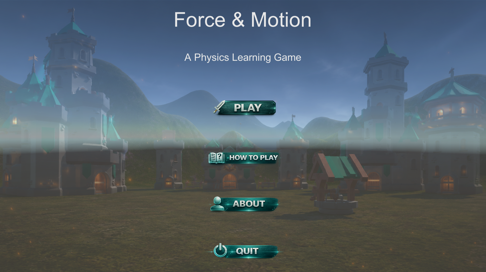
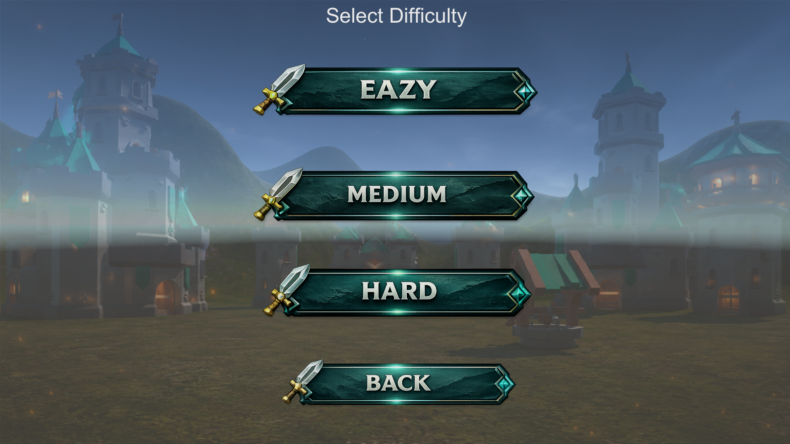
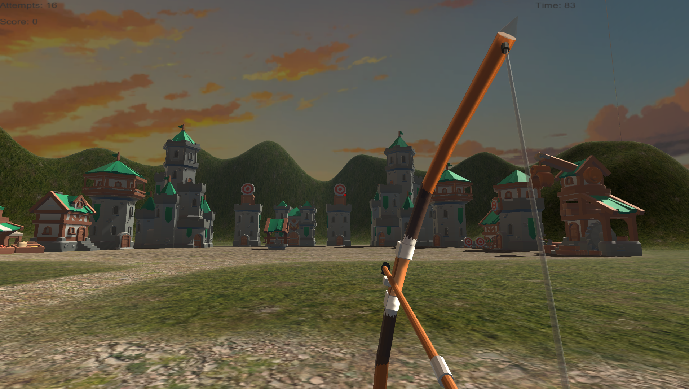
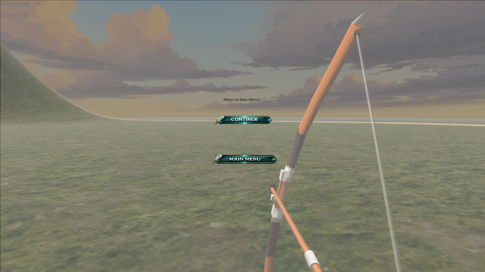
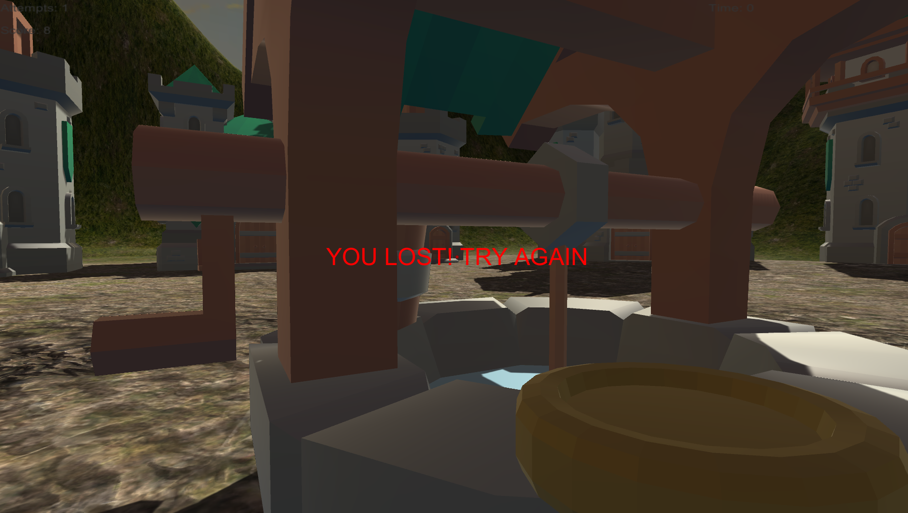

# Physics-Based Game Using Unity

## Project Description

This project is a first-person physics-based game developed using the Unity platform. The player launches projectiles to hit targets while considering gravity, force, and trajectory. The game includes different difficulty levels based on time and number of attempts.

## Features

* First-person player movement
* Projectile launching system
* Physics-based trajectory
* Gravity and force mechanics
* Multiple difficulty levels
* Targets and scoring system

## Technologies Used

* Unity
* C#
* Game Physics
* 3D Game Development

## Controls

* WASD: Move
* Mouse: Look around
* Space: Jump
* Left Mouse Button: Hold to charge and release to shoot

## Project Type

Graduation Project – Bachelor of Computer Science
Northern Border University – Faculty of Computing and Information Technology

## Screenshots

### Main Menu

### Level Selection

### In-Game

### Pause Menu

### Lose Screen

### Win Screen

